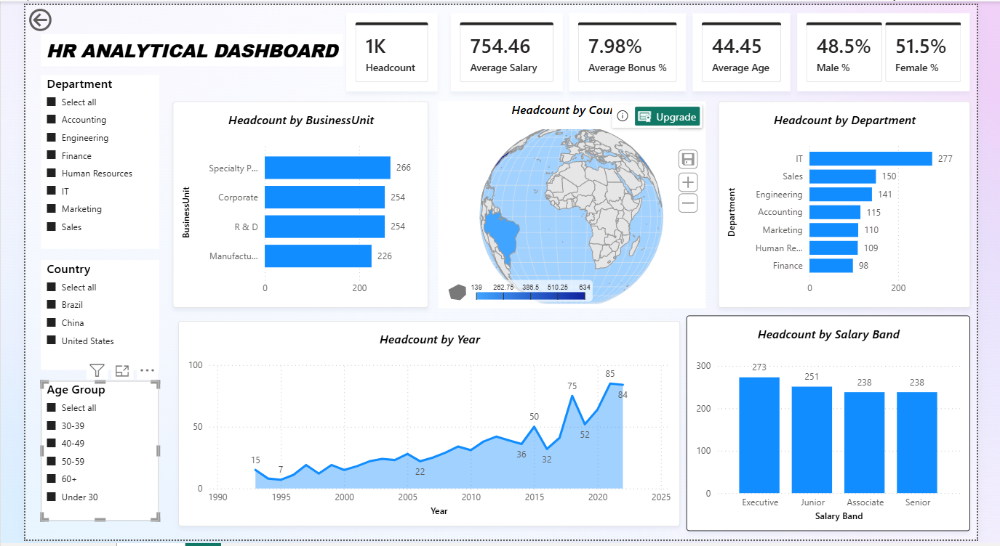

# HR Analytics Dashboard

An interactive **HR Analytics Dashboard** built with Microsoft Power BI to analyze employee workforce data and present key HR metrics through a clear and interactive dashboard.

## 📊 Dashboard Overview

The dashboard analyzes data for **1,000+ employees** and provides insights into workforce composition, compensation, and workforce trends.

### Key KPIs

* Total Headcount
* Salary Analysis
* Bonus Percentage
* Workforce Trends

### Interactive Filters

* Department
* Country
* Age Group

## 🛠️ Tools & Technologies

* **Microsoft Power BI**
* **DAX**
* **Data Cleaning & Transformation**
* **Data Modeling**
* **Data Visualization**

## 📈 Dashboard Features

* Interactive KPI cards for important HR metrics
* Department-wise workforce analysis
* Country-level filtering
* Age-group analysis
* Salary and bonus analysis
* Workforce trend visualization
* Interactive slicers for exploring employee data

## 🖼️ Dashboard Preview



## 📁 Repository Structure

```text
HR_ANALYTICAL_DASHBOARD/
├── HR DATA SET.pbix
├── README.md
└── assets/
    └── hr-analytics-dashboard.png
```

## 🎯 Project Objective

The objective of this project is to transform raw HR data into an interactive Power BI dashboard that makes workforce and compensation information easier to explore and understand.

## 👤 My Contribution

* Cleaned and prepared the HR dataset for analysis
* Built the Power BI data model
* Created DAX measures for key HR metrics
* Designed interactive visualizations and dashboard components
* Added filters for department, country, and age group
* Analyzed workforce and compensation trends

## 🚀 How to Use

1. Download the `HR DATA SET.pbix` file.
2. Open it using **Microsoft Power BI Desktop**.
3. Use the slicers and visualizations to explore the HR data.

## 📌 Note

This project was created for learning and portfolio purposes.
